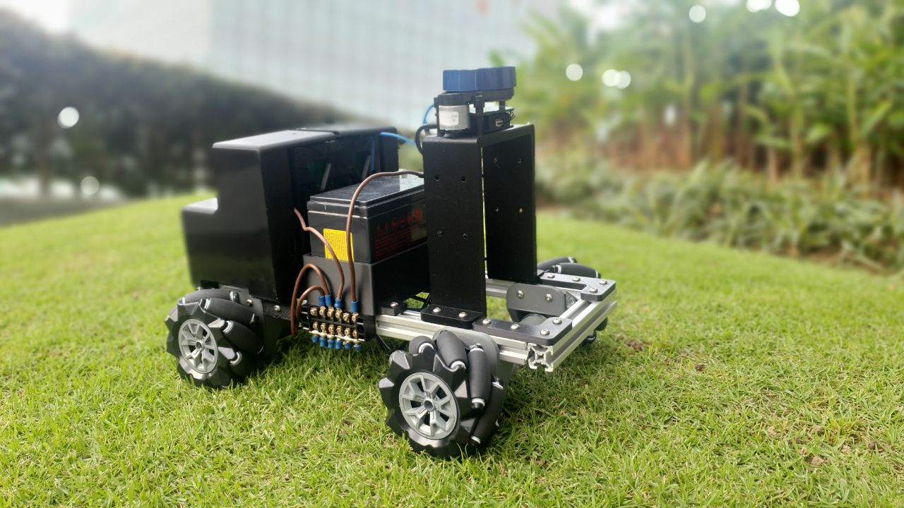
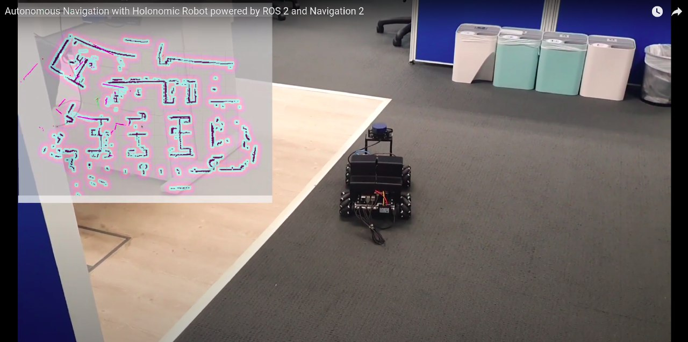
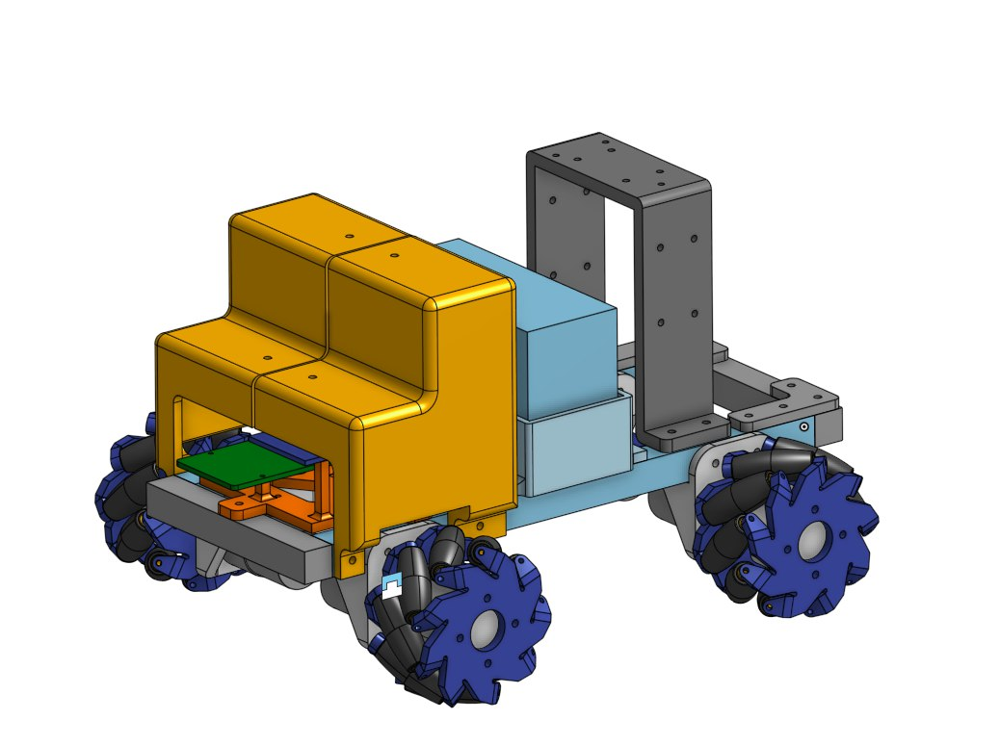

## RAMU (Really Awesome Mobile Unit)

RAMU is a low-cost, wheel encoder-less, holonomic mobile base that is capable of autonomous navigation. RAMU is powered by ROS 2 and Navigation 2 systems. This repository contains some information on RAMU along with ROS 2 packages and launch files to get RAMU up and running.

#### Click the image below to watch RAMU autonomously navigate in an indoor environment. 

[](https://www.youtube.com/watch?v=9J7-lWX2Y_A&feature=youtu.be)


## Hardware Design



RAMU's chassis is constructed from 20x20 aluminium extrusion members which are connected together with 3D printed joints. The motor, battery, electronics and sensors mounts are also 3D printed. The CAD is open sourced via Onshape and can be accessed [here](https://cad.onshape.com/documents/ce8bdc9f696707bc50d70932/w/ef0d68341801b7ffe4e012c3/e/bb0d1657fc848bdd1addb320).

Documentation of the build process is found [here](https://www.yadunundvijay.com/ramu)

### BOM
1. [Raspberry Pi 3B](https://www.raspberrypi.org/products/raspberry-pi-3-model-b/)
2. [Arduino Uno](https://store.arduino.cc/usa/arduino-uno-rev3)
3. [DC geared motors x4](https://www.aliexpress.com/item/32999954820.html?spm=a2g0s.9042311.0.0.65cf4c4dNaN8tW)
4. [Motor drivers x2](https://www.aliexpress.com/item/4000099388630.html?spm=a2g0s.9042311.0.0.65cf4c4dNaN8tW)
5. [Mecanum wheels 96mm diameter x4](https://www.aliexpress.com/item/4001118452729.html?spm=a2g0s.9042311.0.0.65cf4c4dNaN8tW)
6. [2D lidar](https://www.aliexpress.com/item/4000018415971.html?spm=a2g0s.9042311.0.0.65cf4c4dNaN8tW)

## Electrical and Wiring

RAMU's four wheels/motors follow the below numbering convention

```
   ^
   |
w1---w2
|     |
|     |
w3---w4
```

Each motor is controlled by a motor driver which receives PWM signals from the Arduino which in-turn receives motor velocities from the RPi.

The RPi thus has the Arduino and 2D lidar plugged into its USB ports. These devices must be available on `/dev/ttyUSB1` and `/dev/ttyUSB0` respectively. A 12V to 5V DC-DC converter steps down the 12V battery voltage and powers the RPi.

> TODO Add wiring diagram


## Software Setup

### Arduino

RAMU's Arduino receives motor velocities in range [0,255] via serial from the RPi which is used to write PWM signals to the connected motors drivers. Expected format for incoming data:
```
"[w1, w2, w3, w4]"
```

where w1, w2, w3, w4 are the velocities of the wheels as seen in the arrangement above. 


The code to be uploaded to the arduino is located at `arduino/MotorDriver`.

### RPi
RAMU's RPi is running Ubuntu 20.04 Server. The following binaries are installed on the RPi

* [ROS 2 Foxy](https://index.ros.org/doc/ros2/Installation/Foxy/Linux-Install-Debians/)
* [Navigation 2](https://navigation.ros.org/build_instructions/index.html#install)

Other dependencies:
```
python3 -m pip install pyserial
```

Setup a ROS 2 workspace as follows

```
mkdir ~/ws_mecanum_bot/src -p
cd ~/ws_mecanum_bot/src
git clone https://github.com/Yadunund/mecanum_bot.git
git clone https://github.com/Yadunund/ydlidar_ros.git -b X2l-foxy-devel
```

Install all ROS 2 dependencies
```
cd ~/ws_mecanum_bot
rosdep install --from-paths src --ignore-src --rosdistro foxy -yr
```

Next build the workspace
```
cd ~/ws_mecanum_bot
source /opt/ros/foxy/setup.bash
colcon build --parallel-workers 1
```

## Running stuff and having fun

With the Arduino code uploaded and the RPi setup, we have various launch commands to get RAMU running.

First launch the lidar node 
```
cd ~/ws_mecanum_bot
source install/setup.bash
ros2 launch ydlidar lidar.launch.xml
```

Next launch the `base_controller` and `TF2` publishers
```
cd ~/ws_mecanum_bot
source install/setup.bash
ros2 launch mecanum_bot mecanum_bot.launch.xml
```

RAMU can now be teleoperated by publishing `geometry_msgs/Twist` messages over `/cmd_vel` topic. From a second machine with a joystick plugged in,
```
cd ~/ws_mecanum_bot
source install/setup.bash
ros2 launch mecanum_bot joystick_teleop.launch.xml
```

To map an environment using `Cartographer`,
```
cd ~/ws_mecanum_bot
source install/setup.bash
ros2 launch mecanum_bot_cartographer cartographer.launch.xml
```

Save the map files into `mecanum_bot_navigation2/map/` as `map.pgm` and `map.yaml`.

To navigate autonomously,
```
cd ~/ws_mecanum_bot
source install/setup.bash
ros2 launch mecanum_bot_navigation2 navigation2.launch.xml
```
